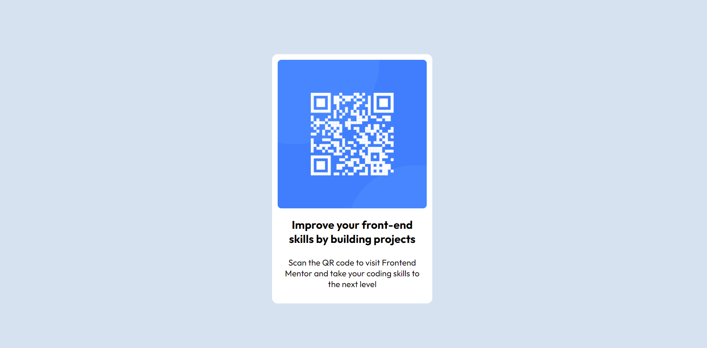

# Frontend Mentor - QR code component solution

This is a solution to the [QR code component challenge on Frontend Mentor](https://www.frontendmentor.io/challenges/qr-code-component-iux_sIO_H).

## Table of contents

- [Overview](#overview)
  - [Screenshot](#screenshot)
  - [Links](#links)
- [My process](#my-process)
  - [Built with](#built-with)
- [Author](#author)

**Note: Delete this note and update the table of contents based on what sections you keep.**

## Overview

To develop a component that displays a QR Code with a title and subtext.

### Screenshot

### Links

- Solution URL: https://abhi-j0407.github.io/qr-code-component/

## My process

- Started with the basic HTML skeleton
- Added fonts, removed default margins, paddings, and borders
- Added required styles

### Built with

- Semantic HTML5 markup
- CSS custom properties
- Flexbox
- CSS Grid

## Author

- Frontend Mentor - https://www.frontendmentor.io/profile/abhi-j0407

